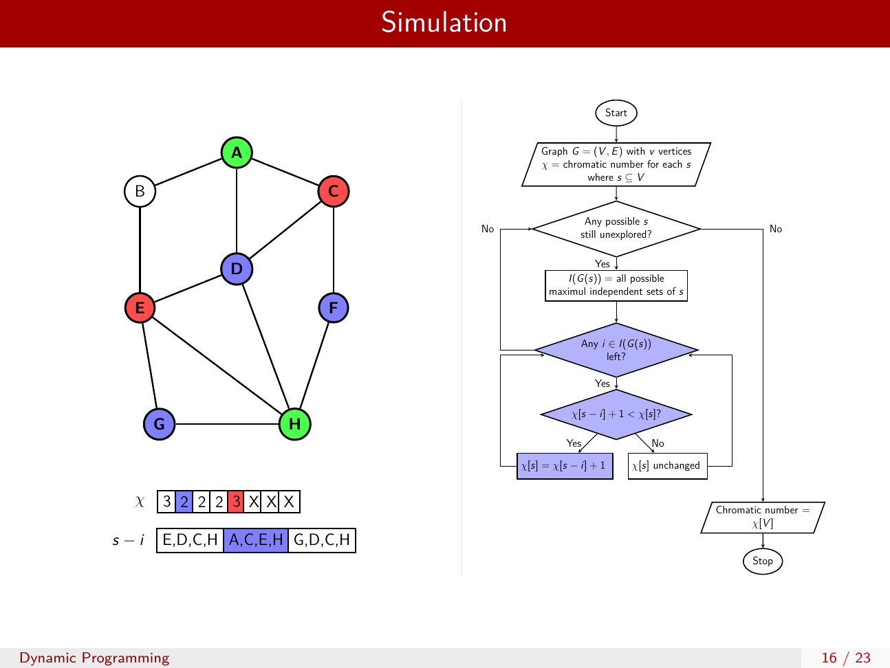

<i>Figure: Sample <code>beamer</code> slide, simulation with <code>tikz</code> </i>

## Latex Online

**Instructions**: Replicate the file [[PDF]](/online/CSE300_Online_A2.pdf)

**Implementation**: `article` [[Code]](/online/1705039.tex) 

**Submission**: [[PDF]](/online/1705039.pdf) 

## Technical Presentation

**Topic**: *"Graph Coloring: Exact and Approximate Algorithms"*

**Implementation**: `beamer`, `tikz` [[Code]](/presentation/main.tex) 

**Submission**: [[PDF]](/presentation/main.pdf) 

## Report Writing

**Topic**: *"Graph Coloring: Exact and Approximate Algorithms"*

**Implementation**: `report`, `algorithm2e` [[Code]](/report/main.tex) 

**Submission**: [[PDF]](/report/main.pdf) 
